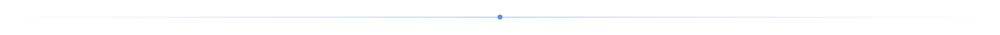

<picture>
  <source media="(prefers-color-scheme: light)" srcset="assets/banner.svg">
  
</picture>

 

### About

I build software end-to-end — from data model to deployment — and I care more about whether a system survives contact with real users than whether it looks good in a demo. My work sits at the intersection of backend engineering, applied security, and automation: Spring Boot services on one side, Discord and Telegram bots on the other, all built to run unattended for a long time rather than just to work in a demo.

I'm currently based in Sivas, Turkey, studying Banking and Insurance, and building independently outside the classroom. That combination — formal grounding in financial systems, informal depth in engineering and security — shapes how I approach product decisions: I tend to design for compliance and trust boundaries as a first-class concern, not an afterthought.

### Philosophy

<table>
<tr>
<td width="33%" valign="top">

**Clean Architecture**
Boundaries between business logic and infrastructure are non-negotiable. Frameworks are a detail; the domain model is the product.

</td>
<td width="33%" valign="top">

**Scalable Systems**
I design for the load I don't have yet — queues over synchronous calls, stateless services, and data models that don't need a rewrite at 10x.

</td>
<td width="33%" valign="top">

**Automation**
If a task will happen more than twice, it becomes a script, a bot, or a pipeline — from CI/CD workflows to the Discord and Telegram bots I build for other communities.

</td>
</tr>
<tr>
<td width="33%" valign="top">

**Long-Term Thinking**
Shipping fast matters, but I optimize for the version of this codebase that exists in two years, not just next week's demo.

</td>
<td width="33%" valign="top">

**Open Source**
Public infrastructure deserves public code where possible. I build in the open and expect to both learn from and give back to it.

</td>
<td width="33%" valign="top">

**Problem Solving**
Security research trains one muscle above all: assume nothing, verify everything. I bring that instinct into every system I design.

</td>
</tr>
</table>

### Current Focus

<!-- CURRENT_FOCUS:START -->
> **Now building:** Maraş Yemek — a subscription-based, no-commission food delivery platform: full-stack, self-hosted geospatial routing, and a Java/Spring Boot backend designed for multi-tenant scale from day one.
>
> **Also building:** Discord and Telegram bots and other automation tooling — mostly private or client work, not yet public on GitHub.
>
> **Also exploring:** applied offensive security tooling and automated vulnerability assessment pipelines.
<!-- CURRENT_FOCUS:END -->

This block is updated by hand as focus shifts — see <code>.github/workflows/readme.yml</code> for the automated activity feed below.

### Featured Products

<table>
<tr>
<td width="50%" valign="top">

**Markasium** (Maraş Yemek)
A subscription-based, no-commission food delivery platform — full-stack, with a self-hosted geospatial stack and a Java/Spring Boot backend built for multi-tenant scale.
 🔒 Private · In development

</td>
<td width="50%" valign="top">

**Ghost Protocol**
A peer-to-peer communication system built in Rust, running entirely over Tor hidden services.
 🔒 Private · Completed

</td>
</tr>
<tr>
<td width="50%" valign="top">

**SENTINEL**
An autonomous security scanner built on LangGraph, orchestrating tools like Nuclei, ffuf, and sqlmap for automated vulnerability assessment.
 🔒 Private · In development

</td>
<td width="50%" valign="top">

**Achievement Hunter**
A Steam progress tracker — Java Spring Boot backend, React frontend, Steamworks4j integration.
 🔒 Private · In development

</td>
</tr>
<tr>
<td width="50%" valign="top">

**Bots & Automation**
Discord and Telegram bots — from multi-bot music architectures to workflow and moderation automation, mostly built for other communities.
 🔒 Private · Ongoing

</td>
<td width="50%" valign="top">

**More on GitHub**
Everything above is private or still in progress — the repositories tab is what's actually public and browsable today.
 <a href="https://github.com/Muhammedpyz?tab=repositories">View repositories →</a>

</td>
</tr>
</table>

### Timeline

| | |
|---|---|
| **Start** | First production code shipped; foundations in backend engineering and Linux systems administration. |
| **Now** | Building Maraş Yemek end-to-end, shipping Discord/Telegram bots on the side, and deepening applied security practice. |
| **Goals** | Ship products that run for years without babysitting, and contribute meaningfully to open-source security tooling. |

### Stats

<picture>
  <source media="(prefers-color-scheme: dark)" srcset="assets/snake-dark.svg">
  <source media="(prefers-color-scheme: light)" srcset="assets/snake-light.svg">
  
</picture>

### Recent Activity

<!--START_SECTION:activity-->
<!--END_SECTION:activity-->

